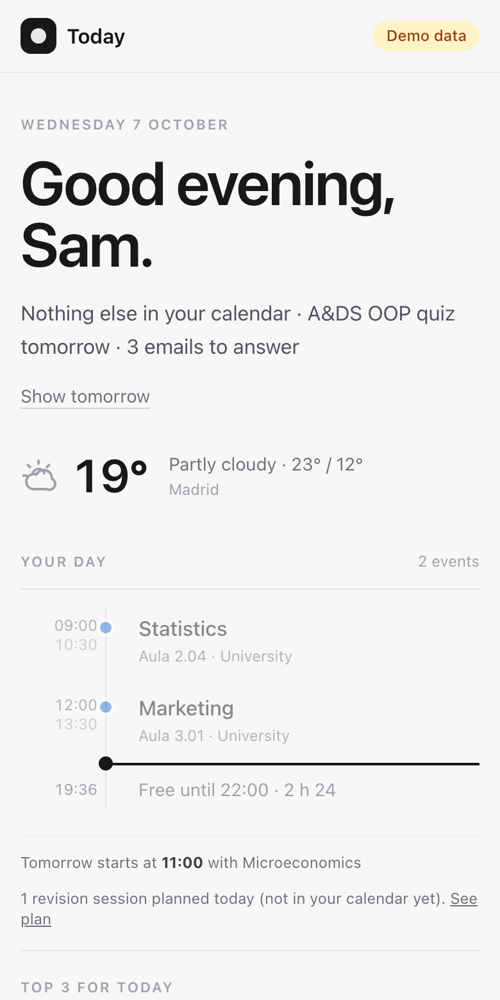
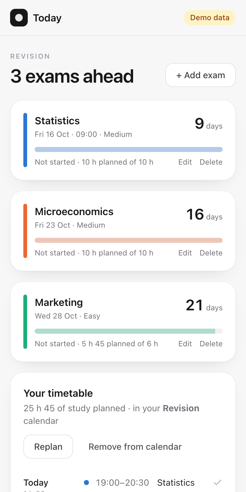

# Today

A morning brief for your Mac, with a revision planner that puts study sessions into your calendar.

Open it (or let it open itself at 8:00 on weekdays) and you see your day on one screen: the weather and whether you need an umbrella, your classes and events on a timeline with your free time, exams and deadlines coming up, reminders due, emails that need a reply, and what's left in your Budget this month.

Add your exams, and Today plans revision around the free time in your calendar. Harder subjects get more hours, sessions get more frequent as an exam gets closer, and there's a review the day before. When you're happy with the plan, one tap puts it in your calendar, so it's on your phone too.

Your data stays on your Mac. There's no account and no cloud.

<p align="center">
  
  &nbsp;
  
</p>

*Screenshots use made-up demo data.*

## Install

You need macOS 12 or newer and Python 3.10+ (`python3 --version`).

```bash
git clone https://github.com/wavymaso/today-app.git
cd today-app
./build.sh --install
```

This runs the tests, builds **Today.app** and copies it to /Applications. Open it from Spotlight. Your data lives in `~/Library/Application Support/Today/` and survives updates.

To try it without your own data: `.venv/bin/python run.py --demo`.

## Setting it up

1. **Calendar.** Today reads the Mac's Calendar app. If your Google calendar is added there (System Settings → Internet Accounts → Google, Calendars on), Today sees it, and revision sessions it adds sync to Google Calendar. The first time, click **Allow calendar access** and say OK to macOS. Reminders work the same way.
2. **Settings → You and the weather.** Your name for the greeting and your city (Madrid by default).
3. **Settings → Calendars.** Untick calendars you don't want in your day (Birthdays, holidays).
4. **Settings → Every morning.** Today can open itself every weekday at a time you pick, and at login.
5. **Settings → Gmail** (optional). Your address and a Gmail *app password*. If the Budget app already has one, click **Use Budget's password**.

## What's on the brief

| Part | Where it comes from |
|---|---|
| Weather | Open-Meteo (free, no account). Umbrella advice when rain is likely while you're out. |
| Your day | Your calendars, as a timeline with free gaps and a line for "now". Tomorrow's first event at the bottom. |
| Coming up | Exams you added, plus calendar events in the next 14 days that look like deadlines ("exam", "entrega", "due", "parcial"…). |
| To do | Reminders due today or tomorrow, and overdue ones from the past week. |
| Needs a reply | Primary-inbox emails from the last two days written by a person, in conversations you haven't answered. Newsletters and no-reply senders are skipped. Gmail is read-only. |
| Money | What's left to spend this month, from the Budget app (read-only). |
| Top 3 | Three things you want to get done today, ticked off as you go. Anything left from yesterday is one tap to carry over. |
| Birthdays | The coming week, from your Birthdays calendar (even if it's hidden from your day). |
| Leave-by time | "Leave by 08:25 for Statistics": the first event of the day with a place, minus the travel time you set. |

Every part works on its own. Offline, you still see your calendar.

**Settings → Sections** switches each card on or off and changes their order. Leave-by time and evening mode are switches there too.

**Evening mode:** from 19:00 the brief shows tomorrow: tomorrow's timeline and weather, when to leave, and your Top 3 for tomorrow, so you can plan it the night before. **Show today instead** switches back.

## Revision

1. **Revision → Add exam.** Subject, date, and how hard it is for you: Easy (6 h), Medium (10 h) or Hard (15 h). You can also set the hours yourself.
2. **Study preferences:** most hours a day, session length, the window you study in, a break between things, and days off.
3. **Make my plan.** Sessions go into free time only, never overlapping your events (with a break around each). The exam that's most behind goes next, subjects are mixed within a day, and no subject gets more than two sessions a day. The last study day before each exam has a shorter review. If there isn't enough time, the exam card says how much doesn't fit.
4. **Add to calendar** once it looks right. Sessions go into a calendar called **Revision** if your account allows Today to create one, or otherwise into your main calendar marked 📚. Today only ever changes or removes events it added itself.
5. **Focus timer:** tap **Start** on one of today's sessions for a full-screen countdown with pause. When it ends, a chime plays, a notification appears, and the session is marked done. Each session in your calendar also gets an alert (10 minutes before by default; change it in Study preferences), so your phone reminds you too.
6. **Day to day:** after a session, mark it **Done** or **Missed** (on the brief or in Revision). **Replan** any time: done sessions count, missed ones are made up, and your calendar is updated.

## Key dates for your class

Today comes with the **BDA · Fall 2026** key dates: midterms, quizzes, assignments and finals for Algorithms & Data Structures, Probability & Statistics, Time Series Analysis, Mathematics for DM&A, Programming for DM&A, Technology with Impact and Español Intermedio 1, with times, rooms, weights and minimum grades from the syllabi.

To use them: **Revision → Import key dates → BDA · Fall 2026**, untick any course that isn't yours (Spanish groups and rooms can differ), and tap **Add these dates**. Then set how hard each exam is *for you* (tap **Edit** on it) and tap **Make my plan**. Dates you already have are never changed or added twice.

The list is a plain file, [`static/key-dates/bda-fall-2026.json`](static/key-dates/bda-fall-2026.json). If a date moves, edit it there (or send a pull request) so everyone gets the fix. A list for another class works the same way: copy the file, change the dates, and either add it to that folder or share it and use **Or use a key-dates file** in the import window.

The dates come from the syllabi matched against the class calendar. Professors can move them, so check Blackboard before relying on them.

## Project layout

```
build.sh              build Today.app (./build.sh --install also installs it)
run.py                run from source (--demo for made-up data)
app/
  brief.py            gathers the morning brief
  calendar_mac.py     calendars and reminders through EventKit (+ a made-up one for demo/tests)
  planner.py          the revision timetable
  weather.py          Open-Meteo
  mail.py             Gmail, read-only over IMAP; app password in the Keychain
  budget_link.py      one line from the Budget app's database (read-only)
  schedule.py         the "open every morning" LaunchAgent
  routers/revision.py exams, plan, calendar
static/               the interface (shares Budget's themes)
macos/                app icon and PyInstaller recipe
tests/                pytest; never touches your real calendar
```

`.venv/bin/python -m pytest` runs the tests.
